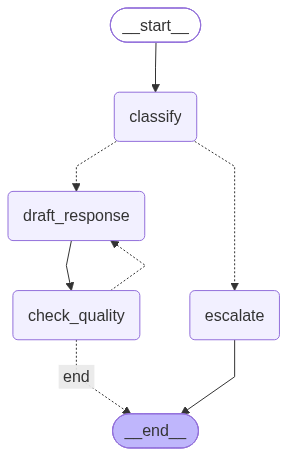

Readme · MD
# Support Ticket Triage Agent
 
A small [LangGraph](https://langchain-ai.github.io/langgraph/) project built to practice core LangGraph concepts — stateful graphs, conditional routing, cycles, and human-in-the-loop workflows — using a realistic support-ticket triage use case.
 
Given a raw support ticket, the agent:
1. Classifies it into a category and priority
2. Routes high-priority tickets to a human for escalation approval (pausing execution until a decision is made)
3. Drafts a response for lower-priority tickets
4. Reviews its own draft, looping back to redraft if it isn't good enough (up to a retry cap)
## Graph
 

 
- **Solid edges** — unconditional transitions
- **Dotted edges** — conditional routing decided at runtime based on state
- **`draft_response` ↔ `check_quality`** — the review loop; a rejected draft is sent back for another attempt (capped at 3 tries)
- **`escalate`** — reached only for high-priority tickets, and paused before execution via LangGraph's `interrupt_before`, waiting for human approval
## Features
 
- **Typed shared state** (`TypedDict`) flowing through every node
- **Conditional edges** for priority-based routing and quality-based looping
- **Cycles** — a genuine revision loop, not just a linear pipeline
- **Human-in-the-loop** — checkpointed with `MemorySaver`, execution pauses before escalation and resumes based on human input via a `thread_id`
- **Interactive CLI** — enter tickets one at a time, approve/reject escalations in the terminal
## Tech stack
 
- Python
- [LangGraph](https://github.com/langchain-ai/langgraph) — graph orchestration
- [LangChain](https://github.com/langchain-ai/langchain) — LLM integration
- GEMINI (`langchain-google-genai`) as the underlying LLM
- [`uv`](https://github.com/astral-sh/uv) for dependency management
## Project structure
 
```
.
├── main.py             # Graph definition, nodes, routing logic, CLI
├── graph.png            # Rendered graph diagram
├── pyproject.toml       # Project dependencies
├── uv.lock               # Locked dependency versions
├── .env.example         # Example environment variables
└── README.md
```
 
## Setup
 
1. Clone the repo
```bash
   git clone https://github.com/jawaidaakif01/Support-Ticket-Triage-Agent-LangGraph.git
   cd Support-Ticket-Triage-Agent-LangGraph
```
 
2. Install dependencies with `uv`
```bash
   uv sync
```
 
3. Set up environment variables
```bash
   cp .env.example .env
```
   Add your GEMINI API key to `.env`:
```
   GEMINI_API_KEY=your_key_here
```
 
## Usage
 
Run the CLI:
```bash
uv add -r requirements.txt
uv run main.py
```
 
Enter a ticket when prompted. Low/medium-priority tickets flow straight through drafting and quality review. High-priority tickets pause for human approval before escalation — type `y` to approve or `n` to reject.
 
Type `quit` to exit.
 
## Why this project
 
Built as a hands-on practice project after going through LangGraph tutorials, specifically to exercise the concepts that distinguish LangGraph from a simple linear LLM chain: shared mutable state across nodes, runtime-decided branching, cycles, and pausable/resumable execution via checkpointing.
 
## Possible extensions
 
- Route rejected escalations to a dedicated `close_ticket` node instead of leaving the run paused
- Replace substring-based classification with structured output (`with_structured_output`)
- Swap `MemorySaver` for a persistent checkpointer (e.g. SQLite) so paused runs survive restarts
 
